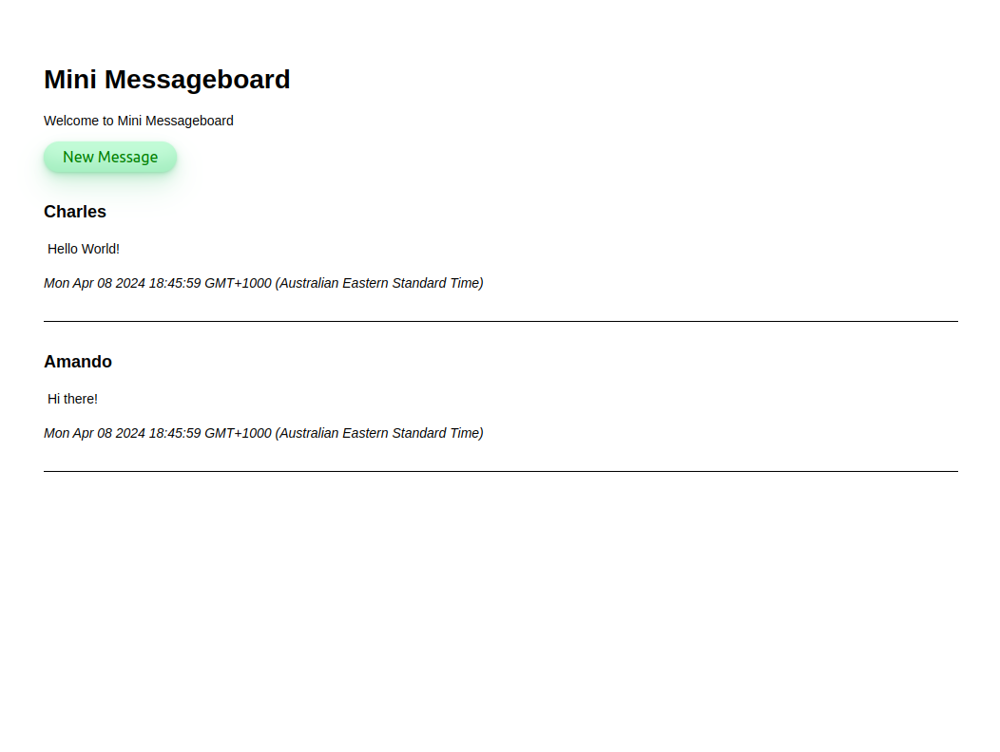

# mini-message-board

A simple web application built with Node.js and Express that allows users to create and view messages on a message board.

## Features

- View a list of existing messages
- Add a new message with a user name and message text
- Display the user name, message text, and date/time added for each message

## Technologies Used

- Node.js
- Express.js
- Template engine (EJS)

Click [HERE](https://mini-message-board-nwrq.onrender.com/ "Live mini message board demo") for the live demo!

